# Belfast WebGPU Library Review & Feedback

This document provides a highly focused technical review of the current Belfast WebGPU library code, focusing entirely on refining its existing APIs to adopt modern, idiomatic WebGPU patterns without global state machine mechanics.

---

## 1. Core Principles: Adapting to Modern WebGPU Design

WebGPU is designed as an **explicit, state-free, multi-threaded graphics API**. Belfast's initial design correctly adopts these concepts by avoiding a global state machine:

- It exposes explicit command encoders and pass encoders in the render loop.
- It encapsulates immutable pipeline creation within the `Draw` helper.
- It leverages WebGPU's modern `layout: "auto"` for bind group layout inference.

To strengthen this direction, Belfast should focus on refining resource configuration, performance, and robust error handling in its current modules.

---

## 2. Component-by-Component Review & Refinement

```mermaid
graph TD
    Device[Device.ts] -->|Provides GPUDevice & Canvas Context| Draw[Draw.ts]
    Device -->|Provides Texture Views| RenderPass[RenderPass.ts]
    GPUResources[GPUResources.ts] -->|Creates Low-Level Buffers/Shaders| Draw

    style Device fill:#1b242d,stroke:#00f2fe,stroke-width:2px;
    style Draw fill:#1b242d,stroke:#00f2fe,stroke-width:2px;
    style RenderPass fill:#1b242d,stroke:#00f2fe,stroke-width:2px;
    style GPUResources fill:#1b242d,stroke:#00f2fe,stroke-width:1px,stroke-dasharray: 5 5;
```



### A. `Device.ts` (Context & Swapchain Management)

The current factory pattern is excellent, but in production environments, WebGPU requires explicit lifecycle management.

#### 1. Robust Device Loss Handling

A GPU device can be lost due to driver updates, power state changes, or execution timeouts. WebGPU handles this asynchronously:

```typescript
// Proposed addition to Device.create() or constructor:
device.lost.then((info) => {
  console.warn(`WebGPU device was lost: ${info.message}`);
  // Trigger user callbacks or re-initialize here
});
```

#### 2. Canvas Swapchain Config Option

The swapchain context currently configures with default usage:

```typescript
context.configure({
  device,
  format,
  alphaMode: options.alpha === false ? "opaque" : "premultiplied",
});
```

In modern WebGPU, you may want to copy from the swapchain (e.g., for screenshots) or bind it (e.g., for compute passes). We should make `usage` customizable:

```typescript
export interface DeviceOptions {
  powerPreference?: GPUPowerPreference;
  alpha?: boolean;
  usage?: GPUTextureUsageFlags; // Allows GPUTextureUsage.RENDER_ATTACHMENT | GPUTextureUsage.COPY_SRC
}
```

---

### B. `GPUResources.ts` (Resource Utilities)

The memory performance of buffer writes is critical in animation loops.

#### 1. Zero-Allocation Buffer Writing

The current `writeBuffer` wrapper allocates a new chunk of memory via `.slice()` whenever an `ArrayBufferView` (like `Float32Array`) is passed:

```typescript
// Current implementation
const source =
  data instanceof ArrayBuffer
    ? data
    : data.buffer.slice(data.byteOffset, data.byteOffset + data.byteLength);

device.device.queue.writeBuffer(buffer, bufferOffset, source);
```

**Feedback:** This creates garbage collection pressure in high-frequency rendering. WebGPU's native `queue.writeBuffer` has built-in offset and size parameters that accept an `ArrayBufferView` directly without slicing:

```typescript
// Proposed high-performance wrapper
export function writeBuffer(
  device: Device,
  buffer: GPUBuffer,
  data: ArrayBuffer | ArrayBufferView,
  bufferOffset = 0,
): void {
  if (data instanceof ArrayBuffer) {
    device.device.queue.writeBuffer(buffer, bufferOffset, data);
  } else {
    // Pass view directly and supply data offsets natively to avoid allocations
    device.device.queue.writeBuffer(
      buffer,
      bufferOffset,
      data.buffer,
      data.byteOffset,
      data.byteLength,
    );
  }
}
```

---

### C. `RenderPass.ts` (Pass Encapsulation)

Currently, `beginRenderPass` only supports a single color swapchain texture. Modern WebGPU pipelines separate color buffers from depth buffers, resolving multisampled passes explicitly.

#### 1. Depth-Stencil Target Integration

To support standard 3D rendering (culling and depth testing), the render pass needs a depth attachment option:

```typescript
export interface RenderPassOptions {
  clearColor?: GPUColor;
  loadOp?: GPULoadOp;
  storeOp?: GPUStoreOp;
  depthStencilAttachment?: GPURenderPassDepthStencilAttachment;
}

export function beginRenderPass(
  commandEncoder: GPUCommandEncoder,
  view: GPUTextureView,
  options: RenderPassOptions = {},
): GPURenderPassEncoder {
  const {
    clearColor = { r: 0.05, g: 0.05, b: 0.08, a: 1 },
    loadOp = "clear",
    storeOp = "store",
    depthStencilAttachment,
  } = options;

  return commandEncoder.beginRenderPass({
    colorAttachments: [
      {
        view,
        clearValue: clearColor,
        loadOp,
        storeOp,
      },
    ],
    depthStencilAttachment,
  });
}
```

---

### D. `Draw.ts` (Pipeline Management)

Currently, `Draw` builds a fixed pipeline state. In modern WebGPU, pipeline states must remain immutable, but they should be configurable at instantiation.

#### 1. Customizable Pipeline Descriptor

Instead of hardcoding a `triangle-list` topology and the swapchain's target format, Belfast should accept configurable states:

- **`primitive`**: Customize culling (`cullMode: "back" | "front" | "none"`) and topology (`point-list`, `line-list`, etc.).
- **`depthStencil`**: Configure depth comparisons when depth testing is active.
- **`targets`**: Configure color formats (allowing offscreen HDR texture targets).

```typescript
export interface DrawOptions {
  label?: string;
  topology?: GPUPrimitiveTopology;
  cullMode?: GPUCullMode;
  depthStencil?: GPUDepthStencilState;
  targets?: GPUColorTargetState[];
}

export class Draw {
  private pipeline: GPURenderPipeline;

  constructor(device: Device, shaderCode: string, options: DrawOptions = {}) {
    const {
      label = "Draw",
      topology = "triangle-list",
      cullMode = "none",
      depthStencil,
      targets = [{ format: device.format }],
    } = options;

    const module = createShaderModule(device, shaderCode, `${label}Shader`);

    this.pipeline = createRenderPipeline(device, {
      label: `${label}Pipeline`,
      layout: "auto",
      vertex: {
        module,
        entryPoint: "vs_main",
      },
      fragment: {
        module,
        entryPoint: "fs_main",
        targets,
      },
      primitive: {
        topology,
        cullMode,
      },
      depthStencil,
    });
  }

  draw(passEncoder: GPURenderPassEncoder, vertexCount = 3, instanceCount = 1): void {
    passEncoder.setPipeline(this.pipeline);
    passEncoder.draw(vertexCount, instanceCount);
  }
}
```

---

## 3. Immediate Code Maintenance Checklist

To maintain your current implementation cleanly:

1. **Update `writeBuffer`** in `packages/belfast/src/core/GPUResources.ts` to implement the zero-allocation strategy.
2. **Expose custom `DrawOptions`** in `packages/belfast/src/helper/Draw.ts` to allow 3D depth-stencil setups and cull modifications without adding global state-machine layers.
3. **Update `RenderPass.ts`** to easily accept a depth stencil attachment target for rendering geometric meshes.

---

## 4. Belfast Triage Decision (May 2026)

### Implement now

- `GPUResources.writeBuffer`: remove `ArrayBufferView` slicing and use native `queue.writeBuffer` offsets
- `Draw` options: allow optional pipeline customization (`primitive`, `depthStencil`, `targets`) while keeping current usage backward compatible
- `RenderPass` options: support optional `depthStencilAttachment`
- Docs updates to reflect API and usage

### Defer

- Device loss handling/recovery callbacks: valid, but deferred until we define lifecycle policy for longer-running examples
- Custom swapchain `usage` in `DeviceOptions`: useful for capture/readback workflows, deferred until a dedicated example needs it

### Ignore for now

- Mermaid hard-coded style directives in this feedback doc (theme-fragile and not aligned with project docs conventions)
- Broad API expansion beyond the current thin-wrapper roadmap for step-2
