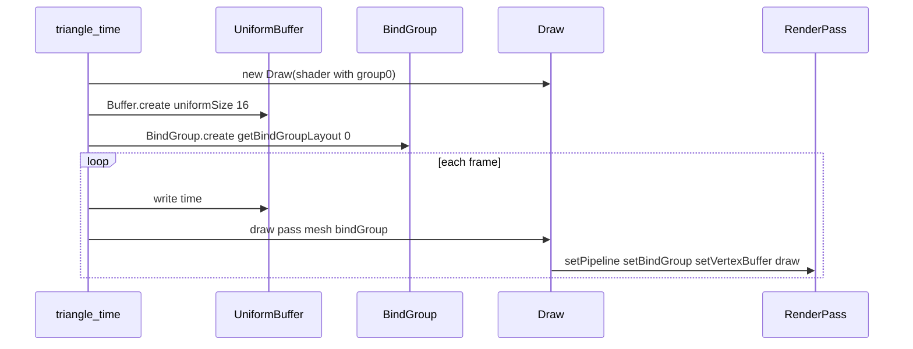

# Implementation: Bind groups and uniforms

**Slug:** `bind-groups-uniforms`  
**Branch:** `refactor` (or current feature branch)  
**Status:** Ready for review  
**Submitted:** 2026-05-24

## Summary

Adds uniform buffer support and a thin `BindGroup` wrapper. `Draw` exposes `getBindGroupLayout()` and accepts an optional bind group in `draw()`. New **triangle-time** example extends the triangle demo with a `time` uniform that scales the mesh via `sin(time)`.

## What changed

### New modules

| File                                                                                        | Purpose                                         |
| ------------------------------------------------------------------------------------------- | ----------------------------------------------- |
| [`packages/belfast/src/core/BindGroup.ts`](../../../packages/belfast/src/core/BindGroup.ts) | `BindGroup.create` + `bind` for uniform buffers |
| [`examples/triangle-time/`](../../../examples/triangle-time/)                               | Animated triangle example                       |

### Modified modules

| File                                                                                  | Change                                          |
| ------------------------------------------------------------------------------------- | ----------------------------------------------- |
| [`packages/belfast/src/core/Buffer.ts`](../../../packages/belfast/src/core/Buffer.ts) | `BufferUsage.uniform`, `Buffer.uniformSize()`   |
| [`packages/belfast/src/helper/Draw.ts`](../../../packages/belfast/src/helper/Draw.ts) | `getBindGroupLayout()`, `draw(..., bindGroup?)` |
| [`packages/belfast/src/index.ts`](../../../packages/belfast/src/index.ts)             | Export `BindGroup`                              |

### Documentation

| File                                              | Purpose                          |
| ------------------------------------------------- | -------------------------------- |
| [`docs/api/BindGroup.md`](../../api/BindGroup.md) | API reference                    |
| [`docs/api/Buffer.md`](../../api/Buffer.md)       | Uniform usage + `uniformSize`    |
| [`docs/api/Draw.md`](../../api/Draw.md)           | Bind group integration           |
| [`docs/api/README.md`](../../api/README.md)       | Export table                     |
| [`docs/overview.md`](../../overview.md)           | Uniforms section; roadmap update |

## API design decisions

### 1. Keep `layout: "auto"`

Pipelines still use auto layout. Bind group layouts come from `pipeline.getBindGroupLayout(0)` after `Draw` is constructed, matching WGSL `@group(0) @binding(0)` without manual layout descriptors.

### 2. `BindGroup` is created once, buffer updated per frame

- `BindGroup.create(device, layout, buffer)` — single uniform buffer entry
- Each frame: `buffer.write(device, data)` — no bind group recreation
- Aligns with review guidance to cache bind groups, not recreate per frame

### 3. `Draw.draw` optional 4th argument

```ts
draw.draw(pass, mesh, 1, bindGroup);
```

Binding order: `setPipeline` → `setBindGroup` → `setVertexBuffer` → `draw`.

`BindGroup.create` accepts a `BindGroupResource[]` for textures/samplers alongside buffers. Procedural draws use `draw(pass, vertexCount, bindGroup, instanceCount)`.

### 4. `Buffer.uniformSize` for WGSL alignment

Uniform structs require 16-byte alignment. `triangle-time` uses a single `vec4<f32>` for `time` (16 bytes). Avoid `f32` + `vec3` in the same struct — WGSL pads that layout to 32 bytes.

## Data flow



## Example: triangle-time

| Piece       | Detail                                                         |
| ----------- | -------------------------------------------------------------- |
| WGSL        | `SceneUniforms { time: vec4<f32> }` at `@group(0) @binding(0)` |
| Scale       | `1.0 + 0.25 * sin(scene.time.x)` on vertex positions           |
| Vertex data | Same positions/colors as triangle (two vertex buffers)         |
| Run         | `pnpm dev:example triangle-time`                               |

[`examples/triangle`](../../../examples/triangle) is unchanged.

## Review checklist

- [ ] Uniform buffer size meets 16-byte alignment
- [ ] Bind group created once, not per frame
- [ ] `draw()` bind order is correct for WebGPU
- [ ] `layout: "auto"` matches WGSL group/binding indices
- [ ] triangle-time runs and animates smoothly
- [ ] API docs match `index.ts` exports

## Out of scope (this PR)

- Multiple bind groups or bindings per group
- Textures and samplers
- Storage buffer bindings
- `Material` type or bind groups on `Mesh`
- Dynamic uniform offsets

## Validation

```bash
pnpm install
pnpm --filter belfast build
pnpm --filter belfast typecheck
pnpm --filter @belfast/example-triangle-time typecheck
pnpm --filter "./examples/*" build
pnpm dev:example triangle-time
```

## Open questions for reviewer

1. Should `BindGroup.create` accept multiple entries in a follow-up, or stay single-uniform focused?
2. Is the 4th `draw()` parameter the right ergonomics vs an options object?
3. Should `Buffer.uniformSize` live on `BindGroup` instead?
