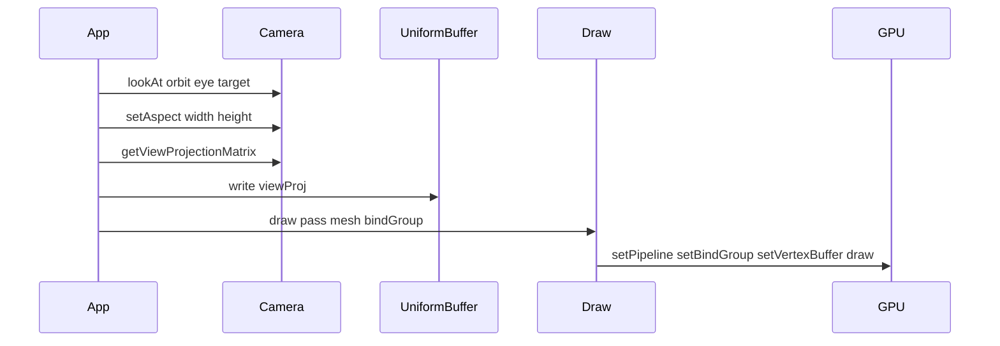

# Implementation: Camera

**Slug:** `camera`  
**Branch:** `refactor` (or current feature branch)  
**Status:** Ready for review  
**Submitted:** 2026-05-24

## Summary

Adds CPU-side camera classes with view and projection matrices, dependency-free `mat4` math, and a **camera-triangle** example that renders a 3D triangle with `viewProj` uniforms, depth testing, and an orbiting perspective camera.

## What changed

### New modules

| File                                                                                                              | Purpose                                      |
| ----------------------------------------------------------------------------------------------------------------- | -------------------------------------------- |
| [`packages/belfast/src/math/types.ts`](../../../packages/belfast/src/math/types.ts)                               | `Vec3`, `Mat4` types                         |
| [`packages/belfast/src/math/mat4.ts`](../../../packages/belfast/src/math/mat4.ts)                                 | `lookAt`, `perspective`, `ortho`, `multiply` |
| [`packages/belfast/src/camera/Camera.ts`](../../../packages/belfast/src/camera/Camera.ts)                         | Base camera                                  |
| [`packages/belfast/src/camera/PerspectiveCamera.ts`](../../../packages/belfast/src/camera/PerspectiveCamera.ts)   | Perspective projection                       |
| [`packages/belfast/src/camera/OrthographicCamera.ts`](../../../packages/belfast/src/camera/OrthographicCamera.ts) | Orthographic projection                      |
| [`examples/camera-triangle/`](../../../examples/camera-triangle/)                                                 | Perspective 3D example                       |
| [`examples/camera-ortho/`](../../../examples/camera-ortho/)                                                       | Orthographic 3D example                      |

### Modified modules

| File                                                                      | Change                           |
| ------------------------------------------------------------------------- | -------------------------------- |
| [`packages/belfast/src/index.ts`](../../../packages/belfast/src/index.ts) | Export cameras + `Vec3` / `Mat4` |

### Documentation

| File                                                                | Purpose          |
| ------------------------------------------------------------------- | ---------------- |
| [`docs/api/Camera.md`](../../api/Camera.md)                         | Base API         |
| [`docs/api/PerspectiveCamera.md`](../../api/PerspectiveCamera.md)   | Perspective API  |
| [`docs/api/OrthographicCamera.md`](../../api/OrthographicCamera.md) | Orthographic API |
| [`docs/api/README.md`](../../api/README.md)                         | Export table     |
| [`docs/overview.md`](../../overview.md)                             | Cameras section  |

## API design decisions

### 1. No `gl-matrix` dependency

Internal `mat4` helpers keep Belfast zero runtime dependencies. Math is not exported as a public module (only `Vec3` / `Mat4` types).

### 2. Base `Camera` stores look-at state

`getPosition()` and `getLookAtTarget()` return copies of the last `lookAt(eye, target, up)` arguments — no matrix inversion required.

### 3. `getFieldOfView()` on base returns `undefined`

`PerspectiveCamera` overrides with radians. `OrthographicCamera` explicitly returns `undefined`.

### 4. Matrices are column-major

`getViewProjectionMatrix()` computes `projection * view` for WGSL `scene.viewProj * vec4(position, 1.0)`.

## Data flow (camera-triangle example)



## Example: camera-triangle

| Piece    | Detail                                      |
| -------- | ------------------------------------------- |
| Geometry | `vec3` triangle in XY plane at z=0          |
| Camera   | `PerspectiveCamera`, orbiting `lookAt`      |
| Uniform  | `mat4x4<f32> viewProj` (64 bytes)           |
| Depth    | `depth24plus` texture + `Draw` depthStencil |
| Run      | `pnpm dev:example camera-triangle`          |

## Example: camera-ortho

| Piece  | Detail                                                             |
| ------ | ------------------------------------------------------------------ |
| Camera | `OrthographicCamera` with aspect-aware `setOrthographic` on resize |
| Run    | `pnpm dev:example camera-ortho`                                    |

## Post-review fixes (Antigravity)

- `mat4.ortho` uses WebGPU Z clip range `[0, 1]` (not OpenGL `[-1, 1]`)
- `OrthographicCamera` args: `left, right, bottom, top` (matches `mat4.ortho`)
- `camera-triangle` updates aspect only when canvas size changes

## Review checklist

- [ ] `lookAt` / `perspective` / `ortho` match expected clip-space behavior
- [ ] `getViewProjectionMatrix` order is `P * V`
- [ ] FOV documented as radians
- [ ] Depth texture recreated on resize
- [ ] API docs match exports

## Out of scope (this PR)

- Ray picking
- Camera-owned GPU uniform buffers
- Orthographic demo app
- Exported `mat4` utility module
- Scene graph

## Validation

```bash
pnpm install
pnpm --filter belfast build
pnpm --filter belfast typecheck
pnpm --filter @belfast/example-camera-triangle typecheck
pnpm dev:example camera-triangle
```
