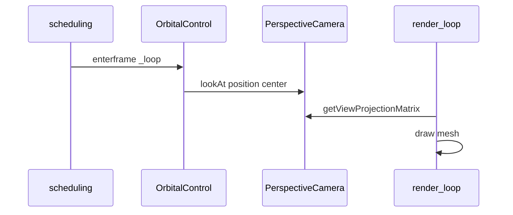

# Implementation: Orbital control and EaseNumber

**Slug:** `orbital-control`  
**Branch:** `refactor` (or current feature branch)  
**Status:** Ready for review  
**Submitted:** 2026-05-24

## Summary

Adds `EaseNumber` (smoothed scalar) and `OrbitalControl` (orbit camera around a pivot) using the **`scheduling`** npm package for enterframe updates, matching alfrid. New **camera-orbit** example: perspective camera, 3D triangle, drag + wheel interaction.

## What changed

### New modules

| File                                                                                                          | Purpose                                       |
| ------------------------------------------------------------------------------------------------------------- | --------------------------------------------- |
| [`packages/belfast/src/utils/EaseNumber.ts`](../../../packages/belfast/src/utils/EaseNumber.ts)               | `Scheduler.addEF` lerp + `destroy()`          |
| [`packages/belfast/src/controls/OrbitalControl.ts`](../../../packages/belfast/src/controls/OrbitalControl.ts) | Spherical orbit + DOM input + camera `lookAt` |
| [`examples/camera-orbit/`](../../../examples/camera-orbit/)                                                   | Interactive orbit demo                        |

### Modified modules

| File                                                                          | Change                                                         |
| ----------------------------------------------------------------------------- | -------------------------------------------------------------- |
| [`packages/belfast/package.json`](../../../packages/belfast/package.json)     | `"scheduling": "^1.4.4"` dependency                            |
| [`packages/belfast/vite.config.ts`](../../../packages/belfast/vite.config.ts) | Externalize `scheduling` in lib build                          |
| [`packages/belfast/src/index.ts`](../../../packages/belfast/src/index.ts)     | Export `EaseNumber`, `OrbitalControl`, `OrbitalControlOptions` |

### Documentation

| File                                                        | Purpose                  |
| ----------------------------------------------------------- | ------------------------ |
| [`docs/api/EaseNumber.md`](../../api/EaseNumber.md)         | API reference            |
| [`docs/api/OrbitalControl.md`](../../api/OrbitalControl.md) | API reference            |
| [`docs/api/README.md`](../../api/README.md)                 | Export table             |
| [`docs/overview.md`](../../overview.md)                     | Orbital controls section |

## API design decisions

### 1. `scheduling` enterframe (alfrid parity)

- `EaseNumber` registers `Scheduler.addEF` in constructor; `destroy()` calls `removeEF`.
- `OrbitalControl` registers `Scheduler.addEF(() => _loop())` to update position and `camera.lookAt`.
- Render loop only reads `getViewProjectionMatrix()` — no `control.update()` in the example.

### 2. `OrbitalControl.destroy()`

Alfrid does not remove enterframe callbacks. Belfast adds `destroy()` to disconnect DOM listeners, remove orbital EF, and destroy owned `EaseNumber` instances (avoids leaks in SPAs).

### 3. Modern wheel events

Uses `wheel` + `event.deltaY` instead of legacy `mousewheel` / `DOMMouseScroll`.

### 4. Types without gl-matrix

`Vec3` tuples; spherical position math inline (same formulas as alfrid).

## Data flow



## Example: camera-orbit

| Piece    | Detail                                                            |
| -------- | ----------------------------------------------------------------- |
| Camera   | `PerspectiveCamera`                                               |
| Control  | `OrbitalControl(camera, { listenerTarget: canvas, radius: 2.5 })` |
| Teardown | `control.destroy()` on `beforeunload`                             |
| Run      | `pnpm dev:example camera-orbit`                                   |

## Review checklist

- [ ] Drag orbit and wheel zoom feel correct
- [ ] Pitch clamped to ±90°
- [ ] `destroy()` removes all Scheduler callbacks
- [ ] `scheduling` listed as dependency; external in Vite build
- [ ] No duplicate enterframe leaks after hot reload (manual check)

## Post-review fixes (Antigravity)

- `normalizeWheelDelta` respects `deltaMode` (pixel / line / page); `zoomSpeed` option
- Pan: middle-mouse or Shift+left-drag moves `center`
- `EaseNumber.setTo` / `add` call `_checkLimit()` immediately
- `MutVec3` type for mutable position tuples

## Out of scope

- Orthographic orbital demo
- Re-exporting `scheduling` from belfast

## Validation

```bash
pnpm install
pnpm --filter belfast build
pnpm --filter belfast typecheck
pnpm --filter @belfast/example-camera-orbit typecheck
pnpm dev:example camera-orbit
```
