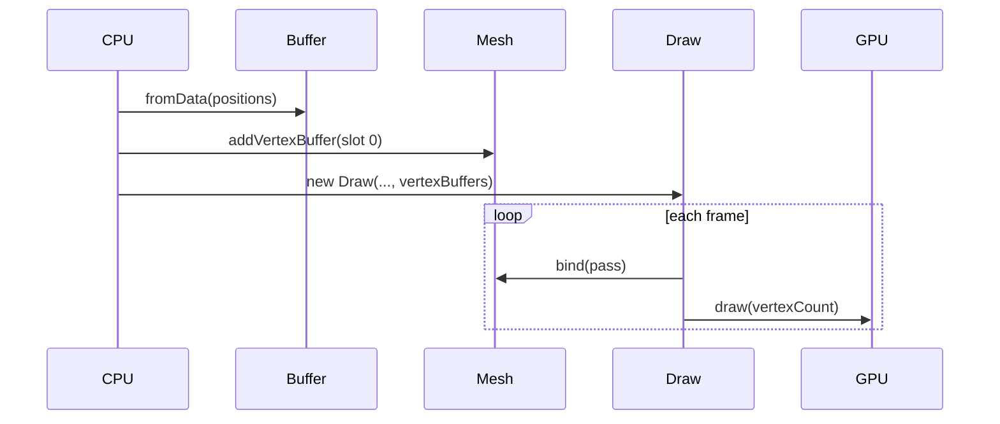

# Implementation: Vertex buffers

**Slug:** `vertex-buffers`  
**Branch:** `refactor` (or current feature branch)  
**Status:** Ready for review  
**Submitted:** 2026-05-24

## Summary

Moves triangle vertex positions from WGSL (`@builtin(vertex_index)`) into a GPU vertex buffer. Introduces shareable `Buffer` and `Mesh` types; `Draw` now requires a `Mesh` for `draw(pass, mesh)` and accepts `vertexBuffers` in pipeline options.

## What changed

### New modules

| File                                                                               | Purpose                                        |
| ---------------------------------------------------------------------------------- | ---------------------------------------------- |
| [`packages/belfast/src/core/Buffer.ts`](../../packages/belfast/src/core/Buffer.ts) | `Buffer` class + `BufferUsage` presets         |
| [`packages/belfast/src/core/Mesh.ts`](../../packages/belfast/src/core/Mesh.ts)     | Multi-slot vertex bindings, layouts, pass bind |

### Modified modules

| File                                                                                               | Change                                                |
| -------------------------------------------------------------------------------------------------- | ----------------------------------------------------- |
| [`packages/belfast/src/helper/Draw.ts`](../../packages/belfast/src/helper/Draw.ts)                 | `vertexBuffers` in `DrawOptions`; `draw(pass, mesh)`  |
| [`packages/belfast/src/index.ts`](../../packages/belfast/src/index.ts)                             | Export `Buffer`, `BufferUsage`, `Mesh`, binding types |
| [`examples/triangle/src/main.ts`](../../examples/triangle/src/main.ts)                             | Create buffer + mesh; pass layouts to `Draw`          |
| [`examples/triangle/src/shaders/triangle.wgsl`](../../examples/triangle/src/shaders/triangle.wgsl) | `@location(0) position` vertex input                  |

### Documentation

| File                                                                  | Purpose                         |
| --------------------------------------------------------------------- | ------------------------------- |
| [`docs/features/vertex-buffers.md`](../../features/vertex-buffers.md) | Feature spec + feedback section |
| [`docs/api/Buffer.md`](../../api/Buffer.md)                           | API reference                   |
| [`docs/api/Mesh.md`](../../api/Mesh.md)                               | API reference                   |
| [`docs/api/Draw.md`](../../api/Draw.md)                               | Updated for mesh-based draw     |

## API design decisions

### 1. `Buffer` is independent of `Mesh`

`Buffer` wraps `GPUBuffer` so the same resource can be:

- Uploaded from CPU (`fromData` / `write`)
- Bound as a vertex buffer (via `Mesh`)
- Used as storage in a compute pass when created with `BufferUsage.vertexStorage`

This addresses buffer sharing without coupling to a single draw call.

### 2. `Mesh.addVertexBuffer` for extensibility

Each binding specifies `buffer`, `arrayStride`, `attributes`, and optional `slot`. Adding colors or UVs is another `addVertexBuffer` call with `@location(1)` in WGSL — no `Draw` API change.

### 3. Pipeline layouts from mesh, bind at draw time

- `mesh.getVertexLayouts()` → passed to `Draw` constructor (`vertexBuffers`)
- `mesh.bind(pass)` → `setVertexBuffer` per slot

Matches WebGPU: layouts are immutable on the pipeline; buffers are bound per pass.

### 4. `draw(pass, mesh | vertexCount)`

Primary path: `draw(pass, mesh)` binds buffers and draws. Procedural path: `draw(pass, vertexCount)` when the pipeline has no vertex buffers (e.g. `@builtin(vertex_index)`).

## Data flow



## Sharing pattern (documented, not exemplified)

```ts
const buffer = Buffer.create(device, size, BufferUsage.vertexStorage);
// compute: write positions into buffer (storage binding)
// render: mesh.addVertexBuffer({ buffer, ... })
```

## Review checklist

- [ ] `Buffer.write` uses zero-allocation path (no `.slice()` on views)
- [x] `Mesh.getVertexLayouts()` pads unused slots with `null`; aligns with `bind()` slots
- [ ] `Draw` pipeline `vertex.buffers` matches WGSL `@location` attributes
- [ ] Triangle example runs unchanged visually
- [ ] API docs match exports in `index.ts`
- [ ] Breaking `draw` signature is acceptable for pre-1.0 library

## Out of scope (this PR)

- Index buffers / `drawIndexed`
- Bind groups / uniforms
- Compute pass example for `vertexStorage`
- Instancing (`stepMode: "instance"`)

## Validation

```bash
pnpm typecheck
pnpm build
pnpm --filter "./examples/*" build
pnpm format:check
pnpm dev:example triangle
```

## Open questions for reviewer

1. Should `Draw` accept `Mesh` in the constructor to avoid passing layouts manually?
2. ~~Should empty `vertexBuffers` keep a legacy `draw(pass, count)` path?~~ Yes — implemented per Antigravity feedback.
3. Is `Mesh` the right name vs `Geometry` (alfrid uses `Mesh`)?
