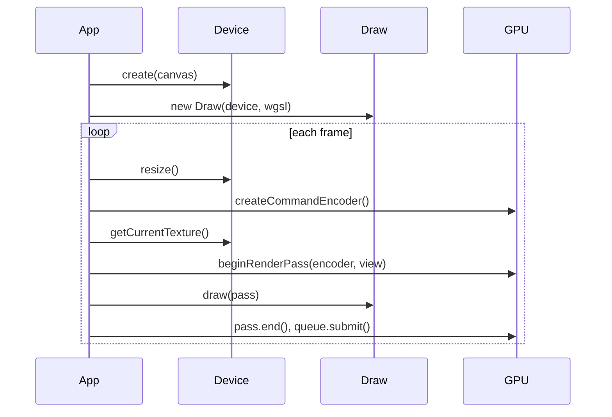

# Overview

Belfast is a thin wrapper around the WebGPU API. It does not hide the GPU — you still create command encoders, submit work to the queue, and write WGSL shaders. The library reduces boilerplate for common setup steps.

## Mental model

| Step    | Belfast API              | WebGPU underneath               |
| ------- | ------------------------ | ------------------------------- |
| Setup   | `Device.create()`        | adapter, device, canvas context |
| Buffer  | `Buffer.fromData()`      | vertex data on GPU              |
| Mesh    | `Mesh.addVertexBuffer()` | layouts + per-pass bind         |
| Uniform | `Buffer` + `BindGroup`   | uniform buffer + bind group     |
| Shader  | `new Draw(device, wgsl)` | shader module + render pipeline |
| Frame   | `beginRenderPass()`      | render pass encoder             |
| Draw    | `draw.draw(pass, mesh)`  | `setPipeline` + `draw()`        |

## Minimal render loop

See the [triangle example](../examples/triangle/src/main.ts):

1. `assertWebGPUSupport()` — fail fast if WebGPU is unavailable
2. `Device.create(canvas)` — configure the swapchain
3. `Buffer.fromData` + `Mesh.addVertexBuffer` — upload positions, describe `@location(0)`
4. `new Draw(device, shaderWgsl, { vertexBuffers })` — compile WGSL + vertex layouts
5. Each frame:
   - `device.resize()` — match canvas pixel size
   - `device.getCurrentTexture().createView()` — swapchain texture
   - `beginRenderPass(encoder, view)` — clear and draw to screen
   - `draw.draw(pass, mesh)` — bind buffers and draw
   - `pass.end()` and `queue.submit([encoder.finish()])`

You can optionally pass `DrawOptions` to configure pipeline state (for example culling, color targets, and depth-stencil state).

## WGSL conventions

`Draw` expects a single WGSL module with:

- Vertex entry point: `vs_main`
- Fragment entry point: `fs_main`
- Fragment output matching the swapchain `format` from `device.format`

Vertex attributes use `@location(N)` in WGSL, matching `Mesh` attribute `shaderLocation` values.

## Depth-ready path

`beginRenderPass` accepts an optional `depthStencilAttachment`, so adding depth testing is a straight extension of the same frame loop:

- Create a depth texture (`format: "depth24plus"`, `usage: RENDER_ATTACHMENT`)
- Pass its view in `beginRenderPass(..., { depthStencilAttachment })`
- Create `Draw` with `depthStencil` options enabled

## Uniforms

For shader uniforms (`@group(0) @binding(0) var<uniform> ...`):

1. `Buffer.create(device, Buffer.uniformSize(n), BufferUsage.uniform)`
2. `new Draw(...)` — pipeline with `layout: "auto"` infers bind layout from WGSL
3. `BindGroup.create(device, draw.getBindGroupLayout(0), buffer)` — once per pipeline
4. Each frame: `buffer.write(device, data)` then `draw.draw(pass, mesh, bindGroup)`

See [triangle-time example](../examples/triangle-time/src/main.ts) for animated scale via a `time` uniform.

## What is not in the public API yet

These exist internally or are planned; they are not exported from `belfast` today:

- Cameras and scene graph
- Index buffers / `drawIndexed`
- Textures and samplers (use `BindGroup.create` with a resource array)
- Multiple bind groups (group indices 1+)
- Loaders, math utilities

When adding features, update [`api/README.md`](api/README.md) and add a focused page under `docs/api/`.
