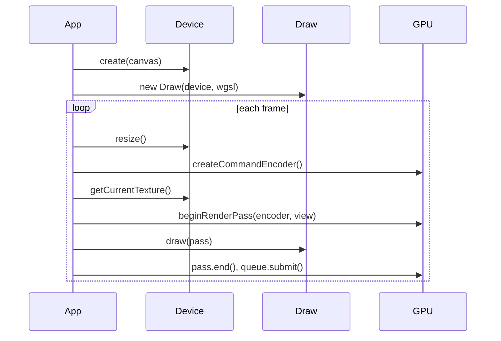

# Overview

Belfast is a thin wrapper around the WebGPU API. It does not hide the GPU — you still create command encoders, submit work to the queue, and write WGSL shaders. The library reduces boilerplate for common setup steps.

## Mental model



| Step    | Belfast API              | WebGPU underneath                      |
| ------- | ------------------------ | -------------------------------------- |
| Setup   | `Device.create()`        | adapter, device, canvas context        |
| Buffer  | `Buffer.fromData()`      | vertex data on GPU                     |
| Mesh    | `Mesh.addVertexBuffer()` | layouts + per-pass bind                |
| Uniform | `Buffer` + `BindGroup`   | uniform buffer + bind group            |
| Camera  | `PerspectiveCamera`      | view / projection matrices             |
| Shader  | `new Draw(device, wgsl)` | shader module + render pipeline        |
| Frame   | `beginRenderPass()`      | render pass encoder                    |
| Draw    | `draw.draw(pass, mesh)`  | `setPipeline` + `draw()/drawIndexed()` |

## Minimal render loop

See the [triangle example](../examples/triangle/src/main.ts):

1. `assertWebGPUSupport()` — fail fast if WebGPU is unavailable
2. `Device.create(canvas)` — configure the swapchain
3. `Buffer.fromData` + `Mesh.addVertexBuffer` — upload positions, describe `@location(0)`
4. `new Draw(device, shaderWgsl, { vertexBuffers })` — compile WGSL + vertex layouts
5. Each frame:
   - `device.resize()` — match canvas pixel size
   - `device.getCurrentTexture().createView()` — swapchain texture
   - `beginRenderPass(encoder, view)` — clear and draw to screen
   - `draw.draw(pass, mesh)` — bind buffers and draw
   - `pass.end()` and `queue.submit([encoder.finish()])`

You can optionally pass `DrawOptions` to configure pipeline state (for example culling, color targets, and depth-stencil state).

## WGSL conventions

`Draw` expects a single WGSL module with:

- Vertex entry point: `vs_main`
- Fragment entry point: `fs_main`
- Fragment output matching the swapchain `format` from `device.format`

Vertex attributes use `@location(N)` in WGSL, matching `Mesh` attribute `shaderLocation` values.

## Depth-ready path

`beginRenderPass` accepts an optional `depthStencilAttachment`, so adding depth testing is a straight extension of the same frame loop:

- Create a depth texture (`format: "depth24plus"`, `usage: RENDER_ATTACHMENT`)
- Pass its view in `beginRenderPass(..., { depthStencilAttachment })`
- Create `Draw` with `depthStencil` options enabled

## Uniforms

For shader uniforms (`@group(0) @binding(0) var<uniform> ...`):

1. `Buffer.create(device, Buffer.uniformSize(n), BufferUsage.uniform)`
2. `new Draw(...)` — pipeline with `layout: "auto"` infers bind layout from WGSL
3. `BindGroup.create(device, draw.getBindGroupLayout(0), buffer)` — once per pipeline
4. Each frame: `buffer.write(device, data)` then `draw.draw(pass, mesh, bindGroup)`

See [triangle-time example](../examples/triangle-time/src/main.ts) for animated scale via a `time` uniform.

## Cameras

`PerspectiveCamera` and `OrthographicCamera` extend `Camera` with projection matrices. Use `lookAt(eye, target)` for the view matrix and `getViewProjectionMatrix()` for a `mat4x4` uniform.

See [camera-triangle](../examples/camera-triangle/src/main.ts) (perspective) and [camera-ortho](../examples/camera-ortho/src/main.ts) (orthographic) for 3D rendering with depth testing.

## Orbital controls

`OrbitalControl` drives a camera with drag-to-orbit and wheel zoom via [`scheduling`](https://www.npmjs.com/package/scheduling) enterframe updates. `EaseNumber` smooths radius and rotation.

```ts
const control = new OrbitalControl(camera, { listenerTarget: canvas, radius: 2.5 });
// render loop: camera.getViewProjectionMatrix() — no control.update() needed
control.destroy(); // on teardown
```

See [camera-orbit example](../examples/camera-orbit/src/main.ts).

## Debug helpers

`AxisHelper` draws long RGB lines on the X/Y/Z axes (default length 1000, alfrid-style). Share the same view-projection uniform bind group as other 3D draws.

```ts
const axes = new AxisHelper(device);
axes.draw(pass, bindGroup);
```

`BallHelper` draws a sphere with per-call position, scale, color, and opacity:

```ts
ball.draw(pass, sceneBindGroup, { position: [0, 0, 0], scale: 0.15, opacity: 0.6 });
```

See [camera-orbit example](../examples/camera-orbit/src/main.ts).

## Textures

`Texture.load` uploads an image to the GPU with a default sampler. Use `createSceneTexturePipelineLayout` and bind `view` + `sampler` with the camera uniform.

```ts
const texture = await Texture.load(device, "/image.jpg");
const { pipelineLayout, bindGroupLayout } = createSceneTexturePipelineLayout(device);
```

See [texture example](../examples/texture/src/main.ts).

## Render to texture

`RenderTarget` provides an offscreen color/depth target and `CopyHelper` blits the rendered texture to the screen.

```ts
const target = RenderTarget.create(device, { width, height, withDepth: true });
const copy = new CopyHelper(device);
```

See [render-to-texture example](../examples/render-to-texture/src/main.ts).

## What is not in the public API yet

These exist internally or are planned; they are not exported from `belfast` today:

- Scene graph
- Full math library (only internal `mat4` helpers used by cameras)
- Texture mipmaps / cubemaps

When adding features, update [`api/README.md`](api/README.md) and add a focused page under `docs/api/`.
