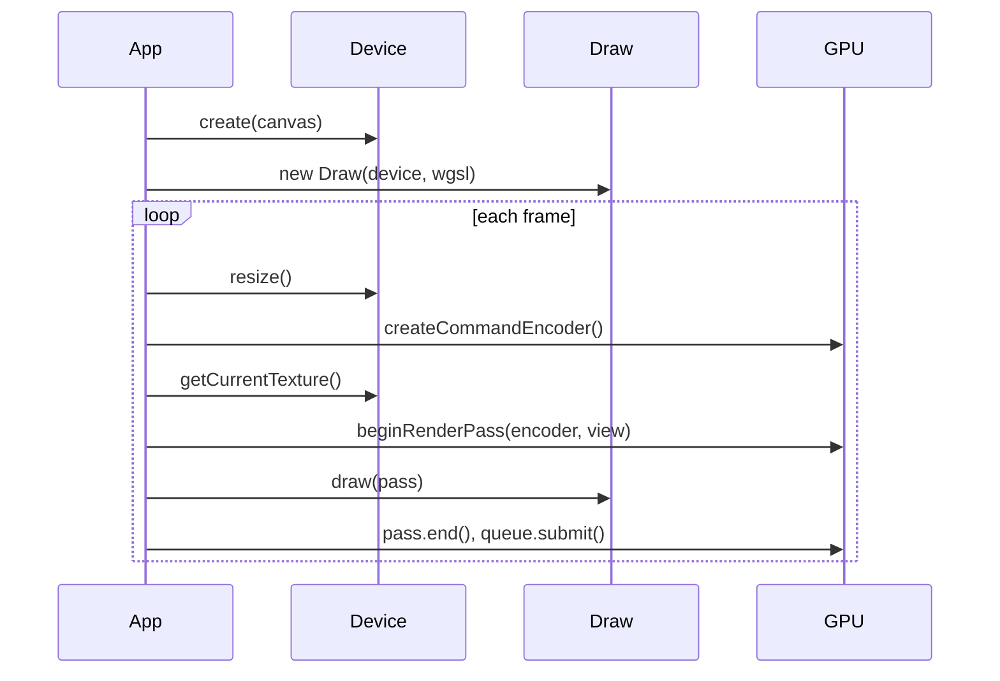

# Overview

Belfast is a thin wrapper around the WebGPU API. It does not hide the GPU — you still create command encoders, submit work to the queue, and write WGSL shaders. The library reduces boilerplate for common setup steps.

## Mental model

| Step   | Belfast API              | WebGPU underneath               |
| ------ | ------------------------ | ------------------------------- |
| Setup  | `Device.create()`        | adapter, device, canvas context |
| Shader | `new Draw(device, wgsl)` | shader module + render pipeline |
| Frame  | `beginRenderPass()`      | render pass encoder             |
| Draw   | `draw.draw(pass)`        | `setPipeline` + `draw()`        |

## Minimal render loop

See the [triangle example](../examples/triangle/src/main.ts):

1. `assertWebGPUSupport()` — fail fast if WebGPU is unavailable
2. `Device.create(canvas)` — configure the swapchain
3. `new Draw(device, shaderWgsl)` — compile WGSL (`vs_main` / `fs_main`)
4. Each frame:
   - `device.resize()` — match canvas pixel size
   - `device.getCurrentTexture().createView()` — swapchain texture
   - `beginRenderPass(encoder, view)` — clear and draw to screen
   - `draw.draw(pass)` — issue draw call
   - `pass.end()` and `queue.submit([encoder.finish()])`

You can optionally pass `DrawOptions` to configure pipeline state (for example culling, color targets, and depth-stencil state).

## WGSL conventions

`Draw` expects a single WGSL module with:

- Vertex entry point: `vs_main`
- Fragment entry point: `fs_main`
- Fragment output matching the swapchain `format` from `device.format`

For a fullscreen-style triangle with no vertex buffers, use `@builtin(vertex_index)` in the vertex shader (as in the triangle example).

## Depth-ready path

`beginRenderPass` accepts an optional `depthStencilAttachment`, so adding depth testing is a straight extension of the same frame loop:

- Create a depth texture (`format: "depth24plus"`, `usage: RENDER_ATTACHMENT`)
- Pass its view in `beginRenderPass(..., { depthStencilAttachment })`
- Create `Draw` with `depthStencil` options enabled

## What is not in the public API yet

These exist internally or are planned; they are not exported from `belfast` today:

- Cameras and scene graph
- Texture / buffer helpers (see `packages/belfast/src/core/GPUResources.ts` — may be exported later)
- Loaders, math utilities

When adding features, update [`api/README.md`](api/README.md) and add a focused page under `docs/api/`.
