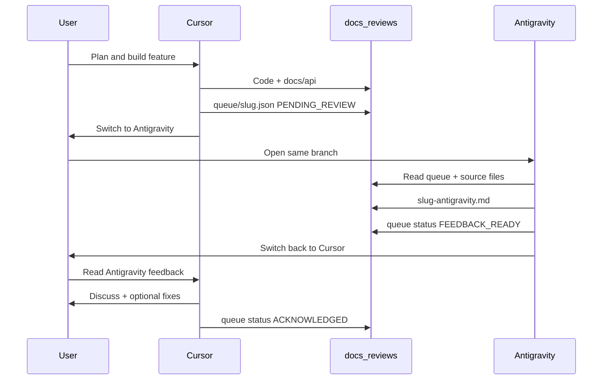

# Cursor ↔ Antigravity review workflow

Belfast features are built in **Cursor**, reviewed in **Antigravity** (separate IDE), and refined back in **Cursor** with you in the loop. Coordination uses **committed files** under `docs/reviews/`—no MCP server required for v1.

Long-lived library notes live in [`docs/feedback.md`](../feedback.md). Per-feature Antigravity reviews live in [`docs/reviews/`](../reviews/).

---

## Roles

| Phase             | Owner             | Output                                                   |
| ----------------- | ----------------- | -------------------------------------------------------- |
| Plan & build      | Cursor + you      | Code under `packages/belfast/`, example if needed        |
| Document          | Cursor            | `docs/api/<Feature>.md`, updates to `docs/api/README.md` |
| Submit for review | Cursor            | `docs/reviews/queue/<slug>.json` (handoff manifest)      |
| Review            | Antigravity + you | `docs/reviews/<slug>-antigravity.md`                     |
| Discuss & refine  | Cursor + you      | Code changes, optional notes in queue manifest           |
| Close             | Cursor            | Queue status → `ACKNOWLEDGED`                            |

---

## Flow (overview)

---

## Next steps in Cursor

Do these when a feature is **implemented and documented**.

### 1. Finish implementation

- [ ] Code in `packages/belfast/src/` (and an example under `examples/` if the feature needs a demo).
- [ ] `pnpm typecheck` passes.
- [ ] `pnpm build` succeeds.

### 2. Document the feature

- [ ] Add or update `docs/api/<Feature>.md`.
- [ ] Update `docs/api/README.md` if the feature is part of the public API.

### 3. Submit for Antigravity review

- [ ] Pick a **slug**: lowercase, hyphenated (e.g. `draw-depth-stencil`).
- [ ] Copy [`docs/reviews/queue/_template-handoff.json`](../reviews/queue/_template-handoff.json) to `docs/reviews/queue/<slug>.json`.
- [ ] Fill in `title`, `summary`, `implementation_paths`, `doc_paths`, set `status` to `PENDING_REVIEW`, set `submitted_at` (ISO 8601).
- [ ] Commit the handoff manifest (and implementation/docs) on the branch Antigravity will use.

### 4. Hand off to the user

Tell the user explicitly:

1. Open **Antigravity** on the **same repo and branch**.
2. Use the reviewer instructions in [`docs/antigravity-reviewer.md`](../antigravity-reviewer.md) (or the saved Antigravity rule/workflow).
3. Ask Antigravity to review slug `<slug>`.

### 5. After Antigravity (when user returns)

- [ ] Read `docs/reviews/<slug>-antigravity.md`.
- [ ] Confirm `docs/reviews/queue/<slug>.json` has `status`: `FEEDBACK_READY`.
- [ ] Summarize feedback for the user: critical vs suggestions vs nits.
- [ ] Agree on follow-ups (fix now, defer, reject).
- [ ] Implement agreed changes if any.
- [ ] Set queue `status` to `ACKNOWLEDGED` and optional `cursor_notes` in the manifest.

### Cursor prompts (copy-paste)

**Submit:**

> Submit this feature for Antigravity review using the cursor-antigravity workflow. Create the queue manifest for slug `<slug>`.

**Ingest feedback:**

> Read Antigravity feedback for `<slug>` from docs/reviews and walk me through critical items and suggested next steps.

---

## Next steps in Antigravity

Do these when Cursor has left a **`PENDING_REVIEW`** entry in `docs/reviews/queue/`.

### 1. Open the repo

- [ ] Same repository and **same branch** as Cursor (pull or sync if needed).
- [ ] Install reviewer guidance: copy [`docs/antigravity-reviewer.md`](../antigravity-reviewer.md) into Antigravity **Rules** or a **Workflow** (one-time setup).

### 2. Find pending work

- [ ] List `docs/reviews/queue/*.json`.
- [ ] Pick entries with `"status": "PENDING_REVIEW"` (ignore `ACKNOWLEDGED` unless re-review requested).

### 3. Claim and review

- [ ] Set queue manifest `status` to `IN_REVIEW` (optional but avoids duplicate reviews).
- [ ] Read every path in `implementation_paths` and `doc_paths`.
- [ ] Review against Belfast/WebGPU criteria (see [`docs/antigravity-reviewer.md`](../antigravity-reviewer.md)).
- [ ] Copy [`docs/reviews/_template-antigravity-feedback.md`](../reviews/_template-antigravity-feedback.md) to `docs/reviews/<slug>-antigravity.md` and fill it in.

### 4. Complete handoff

- [ ] Set queue manifest `status` to `FEEDBACK_READY`.
- [ ] Set `feedback_path` to `docs/reviews/<slug>-antigravity.md` if not already set.
- [ ] Tell the user: switch to **Cursor** and ask to ingest feedback for `<slug>`.

### Antigravity prompts (copy-paste)

**Start review:**

> Review the Belfast feature pending in docs/reviews/queue. Use slug `<slug>`. Follow docs/antigravity-reviewer.md and write docs/reviews/<slug>-antigravity.md.

**List pending:**

> List all docs/reviews/queue manifests with status PENDING_REVIEW and summarize what each feature needs reviewed.

---

## File conventions

### Queue manifest — `docs/reviews/queue/<slug>.json`

| Field                  | Description                                                        |
| ---------------------- | ------------------------------------------------------------------ |
| `slug`                 | Same as filename without `.json`                                   |
| `status`               | `PENDING_REVIEW` → `IN_REVIEW` → `FEEDBACK_READY` → `ACKNOWLEDGED` |
| `title`                | Short human title                                                  |
| `summary`              | 2–4 sentences: what was built and why                              |
| `submitted_at`         | ISO 8601 timestamp                                                 |
| `implementation_paths` | Repo-relative source paths                                         |
| `doc_paths`            | Repo-relative doc paths (usually `docs/api/...`)                   |
| `feedback_path`        | `docs/reviews/<slug>-antigravity.md`                               |
| `cursor_notes`         | Optional; filled when acknowledging                                |

### Feedback — `docs/reviews/<slug>-antigravity.md`

Structured review output. Use the template sections: Summary, Critical, Suggestions, Nits, Test plan gaps.

---

## Branch and sync

- Cursor and Antigravity must see the **same commit** (commit handoff before switching IDEs, or push/pull a shared branch).
- Do not review stale queue entries: check `submitted_at` and git log.

---

## v2 (MCP) — recommended

Use the **belfast-review-bridge** MCP server when both IDEs have it enabled. Same files as v1; agents call tools instead of editing JSON by hand.

**Setup:** [`mcp/README.md`](../../mcp/README.md)  
**Plan reference:** [`mcp-review-bridge-v2-plan.md`](mcp-review-bridge-v2-plan.md)

### Cursor (MCP)

1. Enable **belfast-review-bridge** in Cursor Settings → MCP (`cd mcp && uv sync` first).
2. After build + docs, call **`submit_feature_for_review`** with `slug`, `title`, `summary`, `implementation_paths`, `doc_paths`.
3. Tell the user to switch to Antigravity (same branch).
4. On return, call **`get_feedback_for_cursor`** → discuss → **`acknowledge_feedback`**.

**Prompts:**

> Submit for Antigravity review via MCP. Slug: `<slug>`.

> Use get_feedback_for_cursor for `<slug>` and walk me through critical items.

### Antigravity (MCP)

1. Add server to `~/.gemini/antigravity/mcp_config.json` (see `mcp/README.md`).
2. **`list_pending_reviews`** → **`claim_review`** → **`get_review_bundle`**
3. **`submit_review_feedback`** → **`notify_cursor_handoff`**

**Prompt:**

> Review pending Belfast features via belfast-review-bridge MCP for slug `<slug>`.

### v1 fallback

If MCP is off, use the manual steps in sections above (copy queue JSON, edit status by hand).

---

## Quick links

- Cursor rule: [`.cursor/rules/antigravity-review.mdc`](../../.cursor/rules/antigravity-review.mdc)
- MCP setup: [`mcp/README.md`](../../mcp/README.md)
- v2 plan: [`mcp-review-bridge-v2-plan.md`](mcp-review-bridge-v2-plan.md)
- Antigravity reviewer guide: [`docs/antigravity-reviewer.md`](../antigravity-reviewer.md)
- Reviews folder: [`docs/reviews/`](../reviews/)
- Library-wide feedback (not per-feature): [`docs/feedback.md`](../feedback.md)
