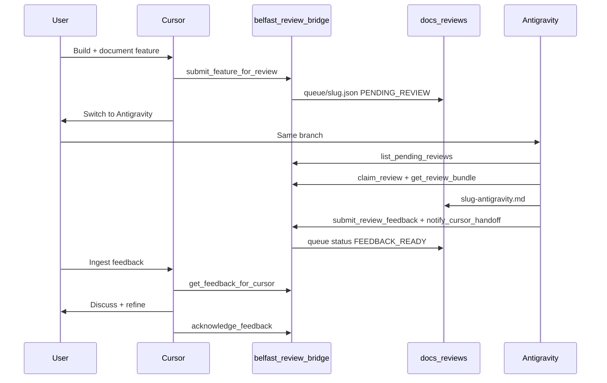

# MCP review bridge v2 — plan & reference

**Status:** Implemented (see [`mcp/`](../../mcp/) and [`mcp/README.md`](../../mcp/README.md)).

Upgrade the file-based v1 workflow ([`cursor-antigravity-review.md`](cursor-antigravity-review.md)) with a shared **MCP bridge** so agents call tools instead of hand-editing JSON. **Antigravity remains a separate IDE session**—the bridge does **not** call an upstream LLM ([`mcp/mcp_plan.md`](../../mcp/mcp_plan.md) mock API is superseded).

v1 stays valid as fallback if MCP is disabled.

---

## Goal



---

## Design principles

| Principle                 | Detail                                                                                                    |
| ------------------------- | --------------------------------------------------------------------------------------------------------- |
| Single source of truth    | MCP reads/writes same paths as v1: `docs/reviews/queue/<slug>.json`, `docs/reviews/<slug>-antigravity.md` |
| No reviewer LLM in bridge | Antigravity agent performs review; Python validates paths, status, bundles                                |
| Backward compatible       | Manual queue edits still work                                                                             |
| Setup docs in `mcp/`      | No root README MCP section                                                                                |

---

## Repo layout

```
mcp/
  server.py
  pyproject.toml
  README.md
  bridge/
    paths.py
    manifest.py
    bundle.py
    state.py
  tests/
.cursor/mcp.json
```

Gitignored: `mcp/.bridge/` (reserved), `mcp/.venv/`

---

## MCP tools (9)

### Cursor

| Tool                        | Behavior                               |
| --------------------------- | -------------------------------------- |
| `submit_feature_for_review` | Create queue manifest `PENDING_REVIEW` |
| `get_review_status`         | One slug or all entries                |
| `get_feedback_for_cursor`   | Read feedback when `FEEDBACK_READY`    |
| `acknowledge_feedback`      | Set `ACKNOWLEDGED`                     |

### Antigravity

| Tool                     | Behavior                              |
| ------------------------ | ------------------------------------- |
| `list_pending_reviews`   | `PENDING_REVIEW` or `IN_REVIEW`       |
| `claim_review`           | → `IN_REVIEW`                         |
| `get_review_bundle`      | Manifest + files (~200KB cap)         |
| `submit_review_feedback` | Write feedback file, `FEEDBACK_READY` |
| `notify_cursor_handoff`  | Store handoff message                 |

**Status:** `PENDING_REVIEW` → `IN_REVIEW` → `FEEDBACK_READY` → `ACKNOWLEDGED`

---

## IDE configuration

### Cursor

Committed [`.cursor/mcp.json`](../../.cursor/mcp.json):

```json
{
  "mcpServers": {
    "belfast-review-bridge": {
      "command": "uv",
      "args": ["run", "--directory", "mcp", "server.py"]
    }
  }
}
```

1. `cd mcp && uv sync`
2. Cursor Settings → MCP → enable **belfast-review-bridge**
3. Reload window

Repo root is auto-detected from `mcp/` parent when `packages/` exists. Override with `WORKSPACE_ROOT` env if needed.

### Antigravity

User-local `~/.gemini/antigravity/mcp_config.json` — see [`mcp/README.md`](../../mcp/README.md).

---

## Operator workflow

1. **Cursor:** build + document → `submit_feature_for_review(...)`
2. **You:** switch to Antigravity (same branch)
3. **Antigravity:** `list_pending_reviews` → `claim_review` → `get_review_bundle` → `submit_review_feedback` → `notify_cursor_handoff`
4. **Cursor:** `get_feedback_for_cursor` → discuss → `acknowledge_feedback`

---

## Out of scope (v2)

- Embedded LLM reviewer in Python (optional v2.1)
- Cursor hooks auto-submit on agent stop
- CI gate requiring review before merge
- `null-g-mcp` remote control of Antigravity from Cursor

---

## Success criteria

- [x] Cursor can `submit_feature_for_review` and create queue manifest
- [x] Antigravity tools read/write same files as v1
- [x] Cursor can `get_feedback_for_cursor` after `FEEDBACK_READY`
- [x] v1 manual workflow still works when MCP is off
- [ ] Manual E2E across both IDEs (user verification)
