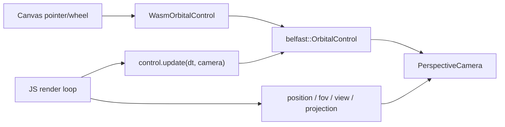

# Wasm Camera + OrbitalControl

> Saved from planning session — August 20, 2026

## Overview

補齊 Rust camera 的 position / FOV / 分離矩陣 API，讓 OrbitalControl 支援 enable/disable 與 damping 動畫轉角，再由 belfast-wasm 用 web-sys 自己 bind canvas，讓 JS 能直接操控。

現況：Rust 已有 [`camera.rs`](../rust/crates/belfast/src/camera.rs) 與 [`orbital_control.rs`](../rust/crates/belfast/src/controls/orbital_control.rs)；wasm 只有薄包裝（`lookAt` / `setAspect` / `getViewProjectionMatrix`），**沒有** position、FOV、分離的 view/projection，也 **沒有** `OrbitalControl`（parity 表標 Pending）。

所有權維持 Rust native 的模型：**camera 由 JS 持有**，control 每幀 `update(dt, camera)` 寫入 pose。Wasm 比 native 多做一件事：自己 bind `listenerTarget` 的 pointer/wheel（TS 風格）。



## 1. Rust camera getters

[`rust/crates/belfast/src/camera.rs`](../rust/crates/belfast/src/camera.rs) 已有 `eye`、`fovy_radians`、`view`、`projection`，只是沒公開。

在 `CameraBase` / 兩個 camera 上補：

- `position() -> [f32; 3]`（last `lookAt` eye）
- `view_matrix()` / `projection_matrix()`（已存在，測試補齊）
- Perspective：`fovy_radians()`、`aspect()`、`near()`、`far()`
- 可選但便宜：`set_fovy_radians()`，與既有 `set_aspect()` 成對

wasm 名稱對齊 TS：`getPosition`、`getViewMatrix`、`getProjectionMatrix`、`getFieldOfView`、`getViewProjectionMatrix`（已有）。Ortho 不提供 FOV。

矩陣繼續回傳 column-major `Vec<f32>`（16 floats），與現有 `getViewProjectionMatrix` 一致。

## 2. Rust OrbitalControl：enable + 動畫轉角

[`orbital_control.rs`](../rust/crates/belfast/src/controls/orbital_control.rs) 已有 `target_yaw` / `target_pitch` + damping，差的是公開 API。

新增：

- `set_enabled(bool)` / `enabled()`：false 時忽略 `pointer_*` / `scroll`，並清掉 `drag_mode`。**`update()` 仍跑**，所以 disable 之後仍可程式動畫。
- `yaw()` / `pitch()`（當前插值值）、`set_yaw` / `set_pitch`（設 target，走既有 damping）
- `snap_yaw` / `snap_pitch`（current + target 一起跳）
- pitch 用與拖曳相同的 ±(π/2 − ε) clamp；yaw `normalize_yaw`
- 程式設角時取消 active drag，避免和滑鼠打架
- 一併公開 `set_radius` / `snap_radius`（orbit pose 的第三軸，API 對稱）

不另做 duration tween / EaseNumber。JS 的「動畫到指定角度」就是 `setYaw(θ)` + 每幀 `update(dt, camera)`。

## 3. Wasm facade

從 [`belfast-wasm/src/lib.rs`](../rust/crates/belfast-wasm/src/lib.rs) 拆出 `camera.rs`，新增 `orbital_control.rs`（`#[cfg(target_arch = "wasm32")]`，與 Texture 一樣）。

**PerspectiveCamera / OrthographicCamera**

補上述 getters；`pub(crate) fn inner_mut()` 給 control 寫 pose。

**OrbitalControl JS 形狀**

```ts
const camera = new PerspectiveCamera(Math.PI / 4, aspect, 0.1, 100);
const control = new OrbitalControl(camera, {
  listenerTarget: canvas, // 省略則純程式控制
  radius: 4,
  center: [0, 0, 0],
  damping: 12,
});

control.update(dt, camera); // 每幀必叫（沒有 TS 的 Scheduler）
control.setEnabled(false); // disconnect listeners + 忽略輸入
control.setYaw(Math.PI / 2); // damping 動畫
control.snapPitch(0.3); // 立即

camera.getPosition();
camera.getFieldOfView();
camera.getViewMatrix();
camera.getProjectionMatrix();
```

實作要點：

- Constructor 吃 `camera` + options（serde camelCase，對齊現有 BindGroup/Draw）。立刻 `update(0, camera)` 寫初始 pose，**不持有 camera**（wasm-bindgen 無法安全存 `&mut` 另一個 JS 物件）。
- `listenerTarget` 用 **pointer + wheel**（pointer 同時覆蓋 mouse/touch）。`Rc<RefCell<belfast::OrbitalControl>>` + `Closure` 捕捉 clone；`setEnabled(false)` / `disconnect()` / `Drop` 都要 remove listener，避免洩漏。
- Wheel 轉成 native 同一套 pixel delta（`deltaMode` line×16 / pixel），再叫 `scroll()`。
- `pointer_move` 的 viewport 用 element `clientWidth/clientHeight`。
- 仍曝出 `pointerDown/Move/Up/scroll`，方便測試或自接輸入。
- `web-sys` 加 features：`HtmlElement`、`EventTarget`、`PointerEvent`、`WheelEvent`、`AddEventListenerOptions`、`Event`。

`connect` / `disconnect` / `destroy` 作為 `setEnabled` 的明確生命週期別名。

## 4. Browser example

新增 [`rust/web/examples`](../rust/web/examples) 的 `camera-orbit`（掛進 [`main.ts`](../rust/web/examples/src/main.ts)）：

- `PerspectiveCamera` + `OrbitalControl({ listenerTarget: canvas })`
- shader uniform **分開** `view` 與 `projection`（證明 getters 能進 WGSL），vertex 做 `projection * view * pos`
- resize 時 `camera.setAspect`
- 鍵盤或按鈕：`setEnabled(false)` 然後 `setYaw(...)` 看阻尼轉過去

走現有 `BindGroup.fromBuffer` + `Buffer.writeData`，不必先擴 `UniformBlock.create`。

## 5. Tests + parity

- [`tests/camera.rs`](../rust/crates/belfast/tests/camera.rs)：`position`、`fovy`、`view`/`projection` 長度與 `view_proj ≈ projection * view`
- [`tests/orbital_control.rs`](../rust/crates/belfast/tests/orbital_control.rs)：`set_yaw` 經 damping 接近 target；`set_enabled(false)` 忽略 drag；`snap_pitch` 立即生效且 clamp
- 更新 [`rust/docs/rust-wgpu-api-parity.md`](../rust/docs/rust-wgpu-api-parity.md)：Camera getters 補註；`OrbitalControl` wasm → Done（註明必須 `update(dt, camera)`，無 Scheduler）

刻意不做：granular `lockZoom/lockRotation/lockPan`、`rx`/`ry` EaseNumber、duration-based `animateTo`、wasm `UniformBlock.create` 任意 schema。

## Implementation todos

- 公開 Perspective/Ortho 的 position、fov、view/projection getters（及測試）
- OrbitalControl：enabled、set/snap yaw/pitch/radius、設角時取消 drag
- belfast-wasm camera 拆出模組，曝出 TS 對齊 getters
- Wasm OrbitalControl：options + pointer/wheel bind、setEnabled、update(dt, camera)
- camera-orbit web example：分離 view/projection uniform + enable/disable 動畫轉角
- 更新 rust-wgpu-api-parity.md
